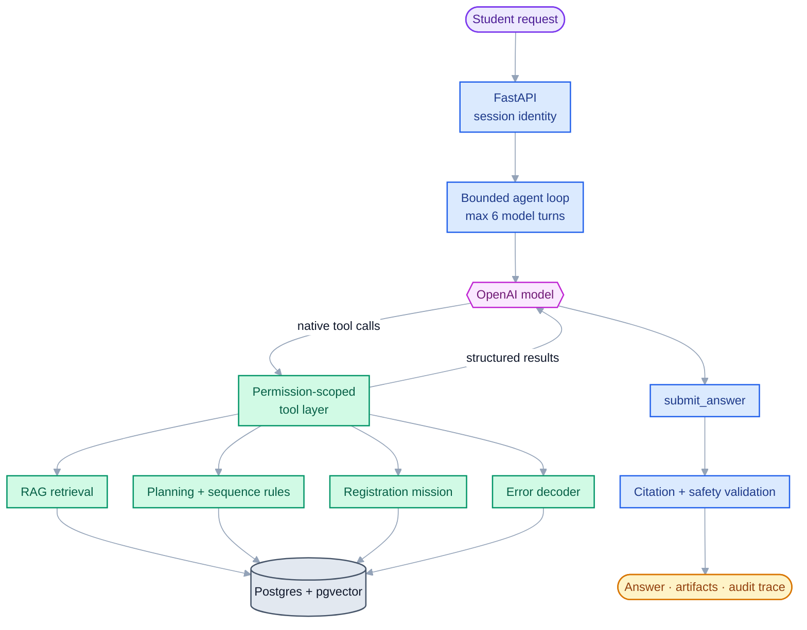
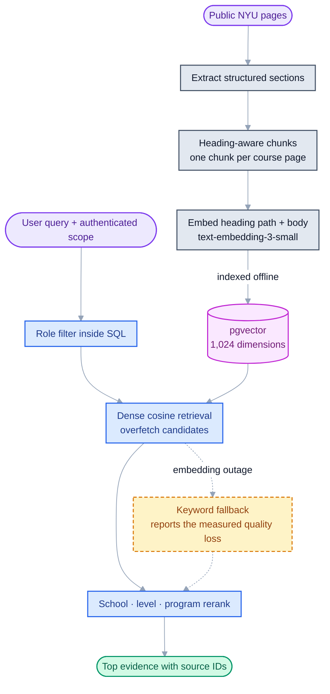

# Path Pilot

<p align="right">
  <b>English</b> · <a href="README.zh-CN.md">中文</a>
</p>

### A bounded, tool-using academic planning agent

[](https://github.com/pingan1224/uax/actions/workflows/eval.yml)

Path Pilot is an AI agent for NYU SPS graduate course planning. It turns a question such as
“What should I take next term?” into a reviewable plan by combining native OpenAI tool
calling, deterministic degree rules, permission-scoped RAG, and a resumable registration
mission.

This repository is primarily an **agent engineering project**, not a chat UI demo. The
interesting work is in deciding what the model may choose, what the server must enforce,
what must remain deterministic, and how those claims are measured.

I designed and implemented the system end to end: the React experience, FastAPI and
Postgres backend, agent runtime and tools, deterministic planning engines, ingestion/RAG
pipeline, evaluation harness, and deployment path.

> Independent personal project. Not affiliated with NYU and not connected to Albert. All
> student records in the demo are fictional; official registration state remains outside
> the system.

## In 60 seconds

| Area | What is implemented |
|---|---|
| Agent runtime | Custom bounded loop over OpenAI Chat Completions tool calling; maximum 6 model turns |
| Tool surface | 9 domain tools plus a structured `submit_answer` protocol function |
| Planning | Deterministic degree audit, prerequisite checks, term sequencing, and mission state |
| RAG | Heading-aware chunks, 1,024-dimensional OpenAI embeddings, pgvector, role filters, and metadata reranking |
| Safety | Server-side authorization, citation validation, write boundaries, rollback, audit logs, and explicit degradation |
| Evaluation | Retrieval, live-model behavior, trajectory, decoder, intake, authorization, mission, and fault probes |

Latest gated run: **PASS** — `gpt-5.4-mini` with `text-embedding-3-small`.

| Evaluation layer | Dataset | Latest result |
|---|---:|---:|
| Retrieval | 50 labelled queries | recall@5 **0.91**, MRR **0.825** |
| Agent behavior | 35 cases × 3 attempts | 30 stable passes, 5 flaky, 0 consistently failing |
| High-stakes behavior | 105 model runs | escalation recall **1.00**, citation coverage **1.00**, leakage failures **0** |
| Registration decoder | 30 labelled messages | 27/30 passed; accuracy when named **1.00** |
| Transcript intake | 9 document/image layouts | 9/9 passed; row recall **1.00** |

[Read the complete latest report →](api/eval/results/report-20260817-224837.md)

## Product in action

These screenshots come from the running application and the seeded fictional student
accounts—not from a design mockup. They are captured by script at 2× against the local
stack, so they are regenerated rather than re-cropped when the UI moves:
`python docs/scripts/capture_screenshots.py`.

**Tool-using answer** — One turn combines mission state, the student's plan, and term
sequencing. The right rail exposes every lookup and how many sources it returned.


**Deterministic degree progress** — Completed, in-progress, and remaining credits are
evaluated against encoded degree requirements; each unmet requirement has evidence and a
next action.


**Resumable registration mission** — Progress is derived from stored facts rather than a
mutable status field. The agent may propose courses, but only the student can confirm
decisions and accept risks.


**Constraint-based course sequence** — Remaining courses are placed across terms using
prerequisites, requirement groups, course load, and published availability—with
unsupported assumptions marked per card.


## What the product can do

| Surface | User outcome | Engineering behind it |
|---|---|---|
| Ask Path Pilot | A cited answer, next-term proposal, or registration explanation | Multi-tool agent loop, structured completion, citation provenance, actionable artifacts |
| Degree Progress | What is complete, in progress, planned, and still required | Deterministic requirement engine over 22 encoded graduate programs |
| Registration Mission | A resumable path from an entered record to an advisor-ready handoff | Derived state machine, student-only decisions, stale-risk detection, Albert checklist |
| Course Planner | A feasible term-by-term order and the cost of deferring a course | Constraint solver over prerequisites, offerings, concentration choice, load, and deadline |
| Error Decoder | A plain-language explanation of a pasted registration error | Evidence-weighted deterministic classifier plus policy retrieval |
| Transcript Intake | Courses extracted from PDF or photo with explicit review states | Text parsing, vision transcription, catalog matching, and an OCR trust boundary |

## Architecture



The LLM is responsible for language understanding, tool selection, and explanation. It is
not responsible for degree arithmetic, prerequisite truth, mission progress, authorization,
or whether a citation really came from a tool result.

| Model decides | Deterministic code decides | Server enforces |
|---|---|---|
| Which relevant tool to call | Whether requirements are satisfied | Which user's data a tool can access |
| Whether more evidence is needed | Prerequisite and sequencing constraints | Iteration and search budgets |
| How to explain verified results | Mission step state and completion | Citation provenance and output schema |
| When uncertainty needs a human | What the available data can actually establish | Write permissions, rollback, and audit logging |

## Agent runtime

The agent does not use LangChain or LangGraph. The current workflow is a deliberately small
custom state machine around native OpenAI function calling:

1. Build an authenticated `ToolContext`; the model never receives or chooses a student ID.
2. Send the conversation and only the tools allowed for that context.
3. Execute requested tools on the server and append structured results.
4. Repeat for at most six model turns; the final turn can only finish.
5. Require `submit_answer`, then validate every cited source ID against sources returned in
   this turn.
6. Persist the tool trace, citations, model, tokens, latency, iterations, and degradation
   modes. If the turn defers after opening a new mission, roll back only that new mission.

The custom loop keeps the control plane inspectable. A graph runtime becomes more valuable
when the product gains durable pauses, external advisor approval, or multi-day resumability;
today the complex state lives in deterministic domain engines rather than in an agent graph.

### Tool surface

| Capability | Tools |
|---|---|
| Policy and catalog evidence | `search_policy`, `get_course_info` |
| Student-specific planning | `get_my_plan`, `get_course_sequence` |
| Registration mission | `get_mission_state`, `start_mission`, `propose_mission_candidates` |
| Registration support | `decode_registration_error`, `albert_checklist` |

Only `start_mission` and `propose_mission_candidates` have business effects. Even those
cannot confirm a course, accept a risk, or finish a mission. The agent proposes; the student
decides through authenticated application endpoints.

The mission itself is six steps, derived from stored facts on every read rather than kept in
a status column. The last one before the advisor handoff records that the student went and
checked the three things only the registrar's system knows — holds, their enrolment
appointment, and seats. **No outcome is stored for those checks and there is no field that
could hold one**, so "you have no holds" is a sentence this system cannot produce, rather
than one it is told not to say.

Core implementation:

- [`agent.py`](api/app/services/agent.py) — bounded loop, completion protocol, validation,
  rollback, and audit record
- [`agent_tools.py`](api/app/services/agent_tools.py) — tool contracts, permission boundary,
  and implementations
- [`llm.py`](api/app/services/llm.py) — thin OpenAI client boundary
- [`missions/steps.py`](api/app/missions/steps.py) — derived mission state machine
- [`planning/rules.py`](api/app/planning/rules.py) — deterministic requirements and
  prerequisite engine
- [`sequence/plan.py`](api/app/sequence/plan.py) — term sequencing and infeasibility
  attribution

## RAG implementation



- Embeddings: `text-embedding-3-small`, explicitly requested at 1,024 dimensions.
- Chunking: heading hierarchy is preserved; small sections are merged and long sections are
  split at paragraph/sentence boundaries. Course pages use one course per chunk.
- Retrieval: dense pgvector cosine search overfetches candidates, then applies soft school,
  level, and program boosts. Role visibility is filtered before ranking.
- Degradation: an embedding outage falls back to keyword retrieval and tells the agent the
  measured quality loss instead of pretending the result is normal.
- Reranking: heuristic metadata reranking is implemented; there is currently no learned
  cross-encoder reranker.

PostgreSQL full-text search and reciprocal-rank fusion are implemented behind a hybrid mode,
but the ablation did not justify enabling it:

| Retrieval mode | recall@5 | MRR | Course-query recall |
|---|---:|---:|---:|
| Dense, current default | **0.91** | **0.8250** | **0.875** |
| Best hybrid RRF arm | 0.90 | 0.7933 | 0.75 |

The dense system already solved all six exact-term evaluation cases. Equal-weight RRF added
more ranking noise than new recall, so “hybrid” remains measured code rather than a default
chosen because it sounds more advanced.

Relevant code and ablations:

- [`retrieval.py`](api/app/services/retrieval.py)
- [`ingest/chunk.py`](api/ingest/chunk.py)
- [`ablate_hybrid.py`](api/scripts/ablate_hybrid.py)
- [`retrieval_cases.py`](api/eval/retrieval_cases.py)

## Reliability is part of the product

The evaluation harness scores more than final answers. A correct response can still be a
bad agent trajectory if it loops, calls forbidden tools, looks up evidence it never uses,
or reaches the answer through a failing dependency.

Measured signals include:

- retrieval recall@5 and MRR, split by query family;
- tool choice, iteration count, repeated calls, failed calls, and path ratio;
- high-stakes escalation recall and over-escalation;
- citation coverage checked against tool-returned source IDs;
- restricted-document leakage and cross-student access;
- decoder coverage versus accuracy when it names a cause;
- transcript row recall and separately reported OCR field errors;
- declared degradation paths exercised through fault injection.

One example: retrieval always returns nearest neighbors, even when the corpus does not
contain an answer. Historical traces showed productive turns used at most four policy
searches while three circling turns used 8, 9, and 13. The shipped mechanism is therefore a
plain five-search budget—one above the observed productive maximum—not an unvalidated
“relevance confidence” threshold.

A second example, from the most recent gates, is the harness catching its author. Grouping
the cases that disagree across attempts by *failure signature* rather than by case id showed
three recurring weaknesses whose membership moves between runs — so chasing an individual
case is chasing a sample. An attempt to fix two of them made the gate fail on a hard zero: a
write tool fired on a question that had not asked for one. It was reverted. Two results
outlived it. All five assertions had been checked and none deserved loosening, which is the
tempting fix and the wrong one — the tests were right and the model was wrong. And because
two things had been changed at once, the run that produced the improvement and the run that
produced the regression were the same run, so neither could be attributed. The rule that
came out of it, now recorded in the repo, is one change per full three-attempt gate.

The run before that is the reason I distrust single runs. It came back with two cases failing
every attempt — something the suite had never produced — and a specific, plausible mechanism
was available to explain it. I wrote that mechanism down as the likely cause. Re-running the
identical code refuted it: those cases were fine and different ones wobbled. A mechanism that
fits one sample of a noisy process is not evidence, and both the claim and its refutation are
kept in the history rather than quietly corrected.

Useful entry points:

- [`run_eval.py`](api/scripts/run_eval.py) — full evaluation and gate
- [`golden.py`](api/eval/golden.py) — agent behavior cases
- [`authz_probe.py`](api/scripts/authz_probe.py) — adversarial authorization checks
- [`mission_probe.py`](api/scripts/mission_probe.py) — end-to-end mission behavior
- [`fault_probe.py`](api/scripts/fault_probe.py) — dependency failure paths

## Product walkthrough

The local `/demo` route contains two fictional students. A useful interview walkthrough is:

1. Ask the agent to prepare a student for a future registration term.
2. Inspect the tool trace: plan → mission → proposals → sequence → Albert boundary.
3. Confirm that proposals do not change mission progress until the student accepts them.
4. Open Degree Progress and compare completed, in-progress, and planned requirements.
5. Paste a registration error and inspect both the deterministic classification evidence
   and cited policy evidence.
6. Upload a synthetic transcript fixture and observe that OCR-derived rows always require
   review.

The repository does not currently expose a public demo URL. Run it locally as described
below.

## Run locally

Prerequisites: Python, Node.js, and PostgreSQL with the pgvector extension. Copy
`api/.env.example` to `api/.env`, then provide `DATABASE_URL` and `OPENAI_API_KEY`.

### First setup

```powershell
Set-Location api
python -m venv .venv
.\.venv\Scripts\python.exe -m pip install -r requirements.txt
Copy-Item .env.example .env

.\.venv\Scripts\python.exe -m scripts.init_db
.\.venv\Scripts\python.exe -m scripts.migrate
.\.venv\Scripts\python.exe -m scripts.seed --reset

Set-Location ..\web
npm.cmd install
```

`seed --reset` replaces the demo data in the configured development database; it is not a
daily startup command.

### Daily startup

Terminal 1:

```powershell
Set-Location api
.\.venv\Scripts\python.exe -m uvicorn app.main:app --reload
```

Terminal 2:

```powershell
Set-Location web
npm.cmd run dev
```

Open `http://localhost:5173/demo`. Vite proxies `/api` to FastAPI on
`http://127.0.0.1:8000`, keeping the session cookie same-origin.

## Verify

```powershell
Set-Location api

# Pure and deterministic tests
.\.venv\Scripts\python.exe -m pytest tests -q

# Real API/database probes
.\.venv\Scripts\python.exe -m scripts.authz_probe
.\.venv\Scripts\python.exe -m scripts.mission_probe

# Paid model/embedding evaluation
.\.venv\Scripts\python.exe -m scripts.run_eval --gate
```

GitHub Actions runs the deterministic checks on every push. The paid full evaluation is a
manual workflow so normal commits do not spend model tokens.

## Repository map

```text
api/app/services/       agent loop, tool layer, retrieval, profile services
api/app/planning/       deterministic degree and prerequisite rules
api/app/missions/       registration mission facts and derived state
api/app/sequence/       constraint-based term sequencing
api/ingest/             fetch, extract, chunk, embed, and catalog ingestion
api/eval/               labelled retrieval, behavior, decoder, and intake cases
api/scripts/            evaluation, probes, migrations, seeding, and ablations
web/src/                React/Vite student experience
docs/                   product requirements and deeper engineering notes
```

For the longer record of design failures, ablations, and why specific safeguards exist,
read the [build journal](docs/build-journal.md).

## Current limits

- Path Pilot cannot read official grades, holds, enrollment appointments, live seats, or
  registration outcomes from Albert. It points the student to the authoritative system.
- Degree auditing covers 22 of 23 SPS graduate programs. The remaining dual degree does not
  publish enough structured requirements to encode without guessing.
- The policy corpus is a dated snapshot; citations carry fetch/verification dates.
- Agent behavior cases are a regression set, not proof of generalization. A held-out set is
  still needed.
- The advisor handoff is a generated summary, not a live institutional queue.
- Course offering data is incomplete, so uncertain sequence placements are labelled as
  assumptions rather than presented as facts.

## Next engineering steps

1. Fix the three flaky trajectory signatures, one change per gated run — diagnosed and
   deliberately unfixed rather than patched by loosening an assertion.
2. Add a held-out agent evaluation set and expand course/tool-choice coverage.
3. Add a learned reranker only if it beats the current dense baseline on held-out queries.
4. Make advisor handoff durable and resumable; that is the point where a workflow runtime
   such as LangGraph would provide material value.
5. Add official data adapters only behind explicit institutional authorization and the
   existing tool permission boundary.

## Stack

React 19 · Vite · FastAPI · SQLAlchemy · PostgreSQL · pgvector · OpenAI tool calling ·
OpenAI embeddings/vision · GitHub Actions · Render · Vercel

## License

MIT
