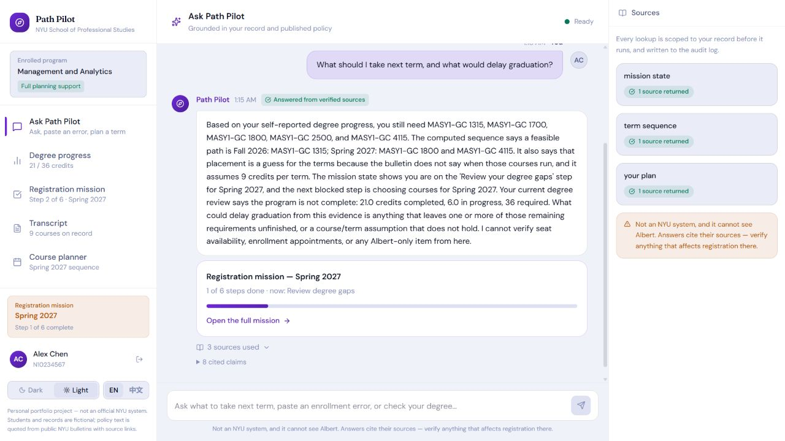
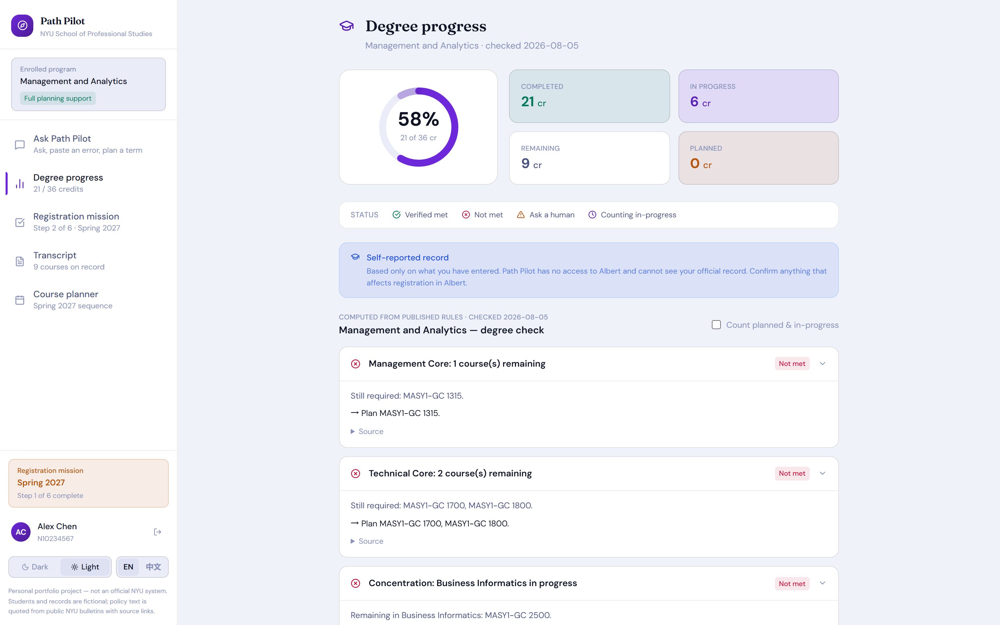
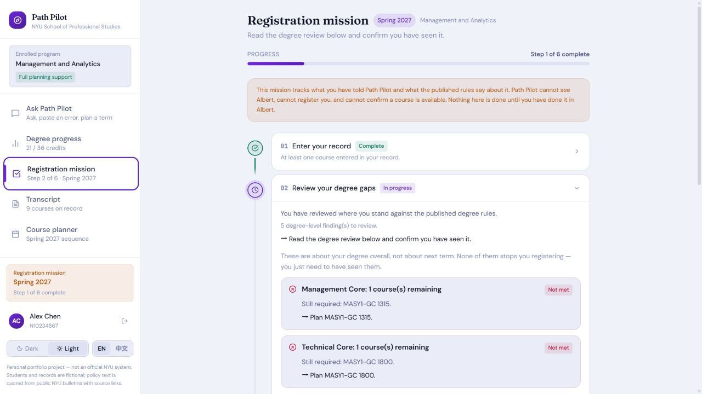
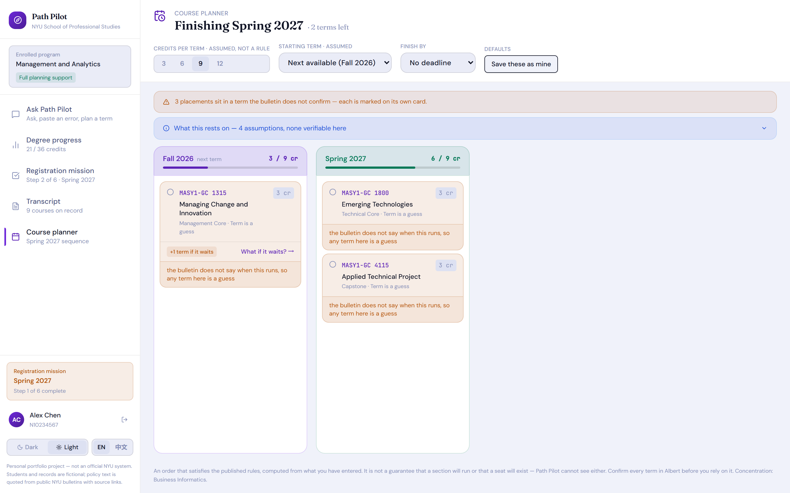
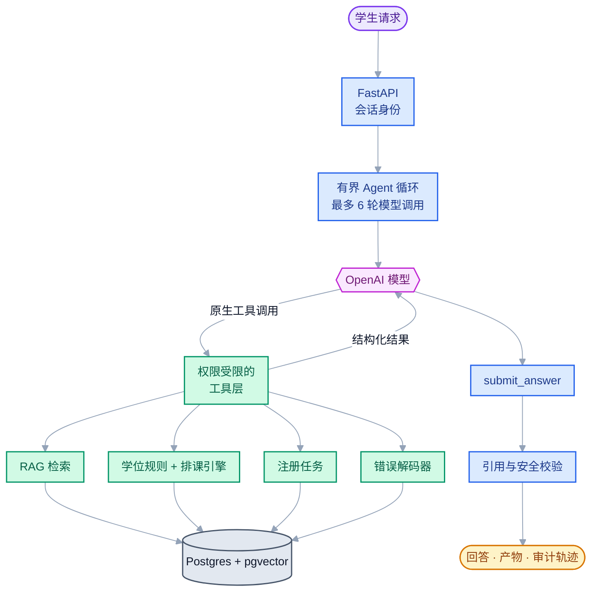
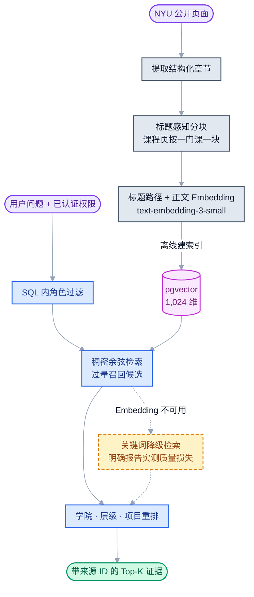

# Path Pilot

<p align="right">
  <b>中文</b> · <a href="README.md">English</a>
</p>

### 一个有边界、会调用工具的学业规划 Agent

[](https://github.com/pingan1224/uax/actions/workflows/eval.yml)

Path Pilot 是一个面向 NYU SPS 研究生选课规划的 AI Agent。它会把“我下学期应该
选什么课？”这类开放问题，转化为一份可以检查、可以追溯的规划结果。系统结合了
OpenAI 原生工具调用、确定性学位规则、带权限边界的 RAG，以及可恢复的注册任务流程。

这个仓库首先是一个 **Agent 工程项目**，而不只是一个聊天界面。项目重点是划清三条
边界：哪些事情可以交给模型判断，哪些事实必须由确定性代码计算，哪些行为必须由服务端
强制约束；同时用评测数据验证这些设计是否真的有效。

项目从前端到后端均为独立完成，包括 React 交互、FastAPI/PostgreSQL 服务、Agent
运行时与工具、确定性规划引擎、文档摄取与 RAG、评测系统及部署路径。

> 这是个人独立项目，与 NYU 无隶属关系，也没有接入 Albert。演示中的学生记录均为
> 虚构数据；真实注册状态仍以学校官方系统为准。

## 60 秒了解项目

| 模块 | 已实现内容 |
|---|---|
| Agent 运行时 | 基于 OpenAI Chat Completions 原生工具调用的自定义有界循环，最多 6 轮模型调用 |
| 工具层 | 9 个领域工具，以及一个结构化的 `submit_answer` 完成协议 |
| 学业规划 | 确定性学位审计、先修课校验、跨学期排课和注册任务状态计算 |
| RAG | 标题感知分块、1,024 维 OpenAI Embedding、pgvector、角色过滤和元数据重排 |
| 安全性 | 服务端鉴权、引用校验、写操作边界、回滚、审计日志和显式降级 |
| 评测 | 覆盖检索、真实模型行为、工具轨迹、错误解码、成绩单导入、权限和故障注入 |

最近一次门禁评测：**PASS** — `gpt-5.4-mini` + `text-embedding-3-small`。

| 评测层 | 数据规模 | 最近结果 |
|---|---:|---:|
| 检索 | 50 条人工标注问题 | recall@5 **0.91**，MRR **0.825** |
| Agent 行为 | 35 个用例 × 3 次运行 | 30 个稳定通过，5 个波动，0 个持续失败 |
| 高风险行为 | 105 次模型运行 | 升级召回率 **1.00**，引用覆盖率 **1.00**，越权泄漏 **0** |
| 注册错误解码 | 30 条标注消息 | 27/30 通过；明确判断原因时准确率 **1.00** |
| 成绩单导入 | 9 种文档/图片布局 | 9/9 通过；课程行召回率 **1.00** |

[查看最近一次完整评测报告 →](api/eval/results/report-20260817-224837.md)

## 实际运行效果

下面的截图来自本地运行中的应用和内置虚构学生数据，不是设计稿。截图由脚本以 2× 分辨率
对本地环境自动拍摄，UI 改动后重新生成而不是手工裁剪：`python docs/scripts/capture_screenshots.py`。

**会调用工具、可追溯的回答** — 一次对话同时组合注册任务、个人计划和跨学期排课。右侧完整
展示工具调用、执行状态以及每个工具返回的来源数量。



**确定性学位进度** — 系统将已完成、进行中和剩余学分与编码后的培养方案进行比对；每个未满足
要求都带有依据和下一步动作。



**可恢复的 Registration Mission** — 进度不是一个可随意修改的状态字段，而是每次根据已保存事实
重新推导。Agent 可以提出课程建议，但确认课程和接受风险只能由学生本人完成。



**基于约束的课程排期** — 排期综合先修关系、培养方案分组、学期负载和课程开设信息；无法被数据
支持的内容会在对应课程卡片上明确标为假设。



## 产品能力

| 页面/能力 | 用户获得的结果 | 背后的工程实现 |
|---|---|---|
| Ask Path Pilot | 有引用的回答、下学期建议或注册问题解释 | 多工具 Agent 循环、结构化完成协议、引用溯源、可操作产物 |
| Degree Progress | 哪些要求已完成、进行中、已规划或尚未满足 | 覆盖 22 个研究生项目的确定性培养方案引擎 |
| Registration Mission | 从录入记录到 Advisor Handoff 的可恢复流程 | 推导式状态机、学生决策边界、过期风险检测、Albert 检查清单 |
| Course Planner | 可行的跨学期顺序，以及推迟某门课的影响 | 基于先修、开课学期、方向、负载和毕业时间的约束规划 |
| Error Decoder | 把粘贴的注册报错转成可理解的原因和下一步 | 带证据权重的确定性分类器 + 政策检索 |
| Transcript Intake | 从 PDF 或照片提取课程，并标出需要人工确认的字段 | 文本解析、视觉转录、课程目录匹配和 OCR 信任边界 |

## 系统架构



LLM 负责理解语言、选择工具和组织解释，但不负责学分计算、先修关系真值、任务进度、
权限判断，也不能自行声明一条引用是有效的。

| 模型可以决定 | 确定性代码负责 | 服务端强制执行 |
|---|---|---|
| 当前问题需要调用哪个工具 | 培养方案要求是否满足 | 工具能访问哪位学生的数据 |
| 是否还需要更多证据 | 先修课和排课约束 | 最大迭代次数和检索预算 |
| 如何解释已经验证的结果 | 注册任务步骤及完成状态 | 引用来源和输出结构 |
| 何时因不确定性建议人工处理 | 现有数据究竟能证明什么 | 写权限、回滚和审计日志 |

## Agent 技术实现

项目没有使用 LangChain 或 LangGraph。当前 Agent 是围绕 OpenAI 原生 function calling
实现的一个小型自定义状态机：

1. 服务端先构造经过认证的 `ToolContext`；模型看不到、也不能选择学生 ID。
2. 把对话和当前身份允许使用的工具发送给模型。
3. 服务端执行模型请求的工具，再把结构化结果加入对话。
4. 最多运行 6 轮；最后一轮只允许收敛，不再无限调用工具。
5. 模型必须通过 `submit_answer` 完成回答，随后服务端逐条检查引用 ID 是否确实来自本轮工具结果。
6. 保存工具轨迹、引用、模型、Token、耗时、迭代次数和降级模式。如果新建任务后本轮被延迟处理，
   只回滚本轮新建的任务。

自定义循环的优势是控制面很小，权限、预算和完成条件都可以直接检查。当前复杂度主要在确定性
领域引擎，而不是 Agent 图。如果未来加入 Advisor 审批、跨天暂停恢复、人工介入和多阶段补偿，
LangGraph 这类工作流运行时才会带来更明显的收益。

### 工具清单

| 能力 | 工具 |
|---|---|
| 政策与课程目录证据 | `search_policy`、`get_course_info` |
| 学生个人规划 | `get_my_plan`、`get_course_sequence` |
| 注册任务 | `get_mission_state`、`start_mission`、`propose_mission_candidates` |
| 注册支持 | `decode_registration_error`、`albert_checklist` |

共实现 **9 个领域工具**。此外还有一个仅用于结构化结束回答的 `submit_answer` 协议函数。
只有 `start_mission` 和 `propose_mission_candidates` 会产生业务侧影响；即使如此，它们也不能
替学生确认课程、接受风险或结束任务。Agent 负责提议，学生必须在经过认证的应用接口中决策。

Registration Mission 共 6 步。系统每次读取时都根据存储事实重新计算状态，而不是依赖一个
可被错误改写的状态列。流程结束前会要求学生亲自去 Albert 检查 holds、enrollment appointment
和 seats；系统没有保存这些官方结果的字段，因此从数据结构上就无法声称“你没有 hold”。

关键实现入口：

- [`agent.py`](api/app/services/agent.py) — 有界循环、完成协议、校验、回滚和审计
- [`agent_tools.py`](api/app/services/agent_tools.py) — 工具契约、权限边界和具体实现
- [`llm.py`](api/app/services/llm.py) — 精简的 OpenAI 客户端边界
- [`missions/steps.py`](api/app/missions/steps.py) — 推导式任务状态机
- [`planning/rules.py`](api/app/planning/rules.py) — 培养方案与先修课规则引擎
- [`sequence/plan.py`](api/app/sequence/plan.py) — 跨学期排序和不可行原因归因

## RAG 技术实现



- **Embedding：** `text-embedding-3-small`，显式指定为 1,024 维。
- **分块：** 保留标题层级；合并过短章节，在段落/句子边界拆分长章节；课程页按一门课一块处理。
- **检索：** pgvector 余弦稠密检索先过量召回候选，再按学院、课程层级和项目做软加权。
- **权限：** 文档可见性在 SQL 排名之前完成过滤，避免先取回敏感内容再由模型判断。
- **降级：** Embedding 服务不可用时切换为关键词检索，并向 Agent 明确暴露质量下降。
- **重排：** 已实现启发式元数据重排；目前没有学习型 Cross-Encoder Reranker。

系统也实现了 PostgreSQL 全文检索和 RRF 混合模式，但消融结果不支持把它设为默认值：

| 检索方式 | recall@5 | MRR | 课程类问题召回率 |
|---|---:|---:|---:|
| 稠密检索（当前默认） | **0.91** | **0.8250** | **0.875** |
| 最优混合 RRF 组合 | 0.90 | 0.7933 | 0.75 |

稠密检索已经覆盖全部 6 条精确学期查询。当前等权 RRF 引入的排名噪声多于新增召回，因此
混合检索被保留为经过测量的实验能力，而不是因为“听起来更先进”就作为默认方案。

相关实现与消融：

- [`retrieval.py`](api/app/services/retrieval.py)
- [`ingest/chunk.py`](api/ingest/chunk.py)
- [`ablate_hybrid.py`](api/scripts/ablate_hybrid.py)
- [`retrieval_cases.py`](api/eval/retrieval_cases.py)

## 可靠性也是产品功能

评测不只检查最终答案。即使答案表面正确，如果 Agent 重复循环、调用禁止工具、检索了从未使用的
证据，或依赖一次失败的工具调用侥幸作答，这条轨迹仍然会被判定为有问题。

当前测量指标包括：

- 按问题类型拆分的检索 recall@5 和 MRR；
- 工具选择、迭代次数、重复调用、失败调用和路径比例；
- 高风险场景升级召回率和过度升级率；
- 引用是否确实来自本轮工具返回的 source ID；
- 受限文档泄漏和跨学生访问；
- 注册错误解码的覆盖率，以及明确判断原因时的准确率；
- 成绩单课程行召回率，并将 OCR 字段错误单独统计；
- 通过故障注入验证声明过的降级路径。

一个具体例子是检索预算。向量检索即使没有正确答案也会返回最近邻。历史轨迹显示，有效回答最多
使用过 4 次政策检索，而 3 次打转的回答分别使用了 8、9、13 次。最终机制因此选择了清晰可验证的
5 次检索上限，而不是未经校准的“相关性置信度”阈值。

另一个例子是模型波动。最近门禁中，按失败签名而不是用例 ID 分组后，可以看到 3 类重复出现、
但成员会在不同运行之间移动的问题。因此修复策略是一次只改一个变量，并完成三次运行门禁；不能
为了让数字变绿而放宽断言。完整的失败、回滚和反证过程保留在构建日志中。

评测入口：

- [`run_eval.py`](api/scripts/run_eval.py) — 完整评测与门禁
- [`golden.py`](api/eval/golden.py) — Agent 行为用例
- [`authz_probe.py`](api/scripts/authz_probe.py) — 对抗式权限检查
- [`mission_probe.py`](api/scripts/mission_probe.py) — 注册任务端到端验证
- [`fault_probe.py`](api/scripts/fault_probe.py) — 依赖故障与降级路径

## 面试演示建议

本地 `/demo` 提供两个虚构学生。一次完整演示可以按以下顺序进行：

1. 让 Agent 为某个未来学期制定注册准备计划。
2. 打开工具轨迹，查看个人计划 → 注册任务 → 候选课程 → 跨学期排课 → Albert 边界。
3. 验证 Agent 提出的候选课程不会直接推进任务，只有学生确认后状态才变化。
4. 打开 Degree Progress，对比已完成、进行中和已规划的培养方案要求。
5. 粘贴一条注册报错，检查确定性分类证据和引用的政策证据。
6. 上传合成成绩单样本，观察 OCR 提取结果始终进入人工复核状态。

仓库目前没有公开 Demo 地址，可以按下面步骤在本地运行。

## 本地运行

需要 Python、Node.js，以及安装了 pgvector 扩展的 PostgreSQL。先复制 `api/.env.example`
为 `api/.env`，再填写 `DATABASE_URL` 和 `OPENAI_API_KEY`。

### 首次安装

```powershell
Set-Location api
python -m venv .venv
.\.venv\Scripts\python.exe -m pip install -r requirements.txt
Copy-Item .env.example .env

.\.venv\Scripts\python.exe -m scripts.init_db
.\.venv\Scripts\python.exe -m scripts.migrate
.\.venv\Scripts\python.exe -m scripts.seed --reset

Set-Location ..\web
npm.cmd install
```

`seed --reset` 会替换开发数据库中的 Demo 数据，只在首次初始化或明确需要重置时使用。

### 日常启动

终端 1：

```powershell
Set-Location api
.\.venv\Scripts\python.exe -m uvicorn app.main:app --reload
```

终端 2：

```powershell
Set-Location web
npm.cmd run dev
```

访问 `http://localhost:5173/demo`。Vite 会把 `/api` 转发到
`http://127.0.0.1:8000`，让会话 Cookie 保持同源。

## 验证项目

```powershell
Set-Location api

# 纯逻辑与确定性测试
.\.venv\Scripts\python.exe -m pytest tests -q

# 真实 API / 数据库探针
.\.venv\Scripts\python.exe -m scripts.authz_probe
.\.venv\Scripts\python.exe -m scripts.mission_probe

# 会产生模型与 Embedding 费用的完整评测
.\.venv\Scripts\python.exe -m scripts.run_eval --gate
```

GitHub Actions 会在每次 push 时执行确定性检查。付费的完整评测使用手动工作流，避免普通提交
持续消耗模型 Token。

## 仓库结构

```text
api/app/services/       Agent 循环、工具层、检索和学生服务
api/app/planning/       确定性学位要求与先修规则
api/app/missions/       注册任务事实与推导状态
api/app/sequence/       基于约束的跨学期排课
api/ingest/             抓取、提取、分块、Embedding 和课程目录摄取
api/eval/               检索、Agent 行为、错误解码和导入标注集
api/scripts/            评测、探针、迁移、种子数据和消融实验
web/src/                React/Vite 学生端体验
docs/                   产品需求和深入工程记录
```

如果希望了解设计失败、消融实验以及每项防护为什么存在，可以继续阅读
[构建日志](docs/build-journal.md)。

## 当前限制

- Path Pilot 无法读取 Albert 中的正式成绩、holds、enrollment appointment、实时余位或注册结果，
  只能引导学生前往权威系统检查。
- 学位审计覆盖 23 个 SPS 研究生项目中的 22 个；剩余双学位项目没有公开足够结构化要求，无法在
  不猜测的前提下编码。
- 政策语料是带日期的快照，引用会携带抓取和验证日期。
- Agent 行为用例是回归集，不等于泛化能力证明；仍需增加独立保留测试集。
- Advisor Handoff 目前是生成的摘要，还不是与学校系统连接的真实队列。
- 课程开设数据并不完整，因此不确定的学期安排会标记为假设，而不是伪装成事实。

## 下一步工程计划

1. 逐类修复 3 种波动轨迹签名，每次只改一个变量并重新通过完整门禁。
2. 增加 Agent 独立保留测试集，并扩充课程查询和工具选择覆盖。
3. 只有学习型 Reranker 在保留集上超过当前稠密基线时，才加入线上默认路径。
4. 将 Advisor Handoff 做成可持久化、可暂停恢复的流程；届时再引入 LangGraph 一类工作流运行时。
5. 官方数据适配器只在获得明确机构授权后接入，并继续受现有工具权限边界保护。

## 技术栈

React 19 · Vite · FastAPI · SQLAlchemy · PostgreSQL · pgvector · OpenAI tool calling ·
OpenAI embeddings/vision · GitHub Actions · Render · Vercel

## License

MIT
