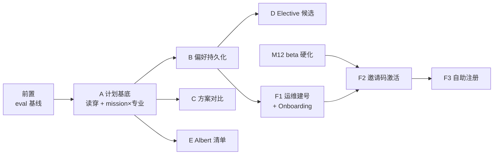

# 闭环方案：M13–M16

2026-08-16 制定，基线 `main@8e7e7d3`（PR #1、#2 已合并）。
在线版本（含样式）：https://claude.ai/code/artifact/7017d2ae-e8cd-406d-a2e5-124e486bb567

现状一句话：规划计算已经很强，但学生「建立状态 → 表达目标 → 比较方案 → 确认执行 →
回流更新」的闭环没有接通。本方案把五个产品缺口排成六个阶段，每一步都在现有架构规则
之内 —— 不发明新的真相源，不承诺产品没有的能力。

## 不变量：方案的边界

以下规则来自 CLAUDE.md 与源 RFP，本方案每一项设计服从它们，冲突时以它们为准：

1. **没有状态列。** 进度从事实重算（`steps.compute_state` 的原则），存储的只能是
   「某人在某时做了某事」。
2. **没有 Albert 集成，永远没有。** 学生记录是自报的；产品永远不说「我看到了你的记录」。
3. **结论由确定性规则引擎计算，模型只叙述并引用。**
4. **陈旧性披露，不隐藏。**
5. **高风险升级给人。** Live 模式不开假工单 —— 升级是「建议 + handoff」，且在 UI 里说明。
6. **写工具面保持最小。** 现有两个；任何新增必须进 `eval/golden.WRITE_TOOLS` 并单独论证。
7. **真实目录与 demo fixtures 严格隔离**，真实学生的规划不得经过虚构课程。

## 总览、依赖与里程碑

| 里程碑 | 内容 | 估计 |
|---|---|---|
| M13 | 前置 eval 基线 + Phase A | 2–3 个工作日 |
| M14 | Phase B + Phase C（同动 sequence，一起做） | 4 个工作日 |
| M15 | Phase D + Phase E（可并行） | 3–5 个工作日 |
| M16 | Phase F1 + Onboarding；F2/F3 挂 M12 之后 | 2–3 个工作日（+M12） |

估计为单人专注工作日，含测试与 eval 更新，不含评审等待。

## P0 · 前置：还清 eval 基线债

**为什么挡在最前面：** B、C、E 都会改 agent 工具的返回载荷（sequence 的 meta、
alternatives、清单状态）。而行为基线仍是 Kimi 时代的 —— 换到 gpt-5.4-mini 后唯一的
测量是一次三例冒烟跑，其中 2/3 的运行出现失败的工具调用，B05 把标注 answered 的用例
升级了。没有当前模型的完整基线，之后每次载荷改动的回归都无从判定。

动作：跑一次完整 `--gate --repeat 3`（35 用例 × 3 次），结果按惯例记入文档。若 gate
不过 —— 尤其失败工具调用率 —— 先修模型适配（提示词或 `CHAT_REASONING_EFFORT`），
修完再进 Phase A。

**验收：** 完整 gate 结果落盘（`eval/results/`），CLAUDE.md 的「欠着一次完整运行」段落
被结果替换；失败工具调用率与 Kimi 基线（0）的差距有结论。

## Phase A · 统一计划基底

**问题：** "Add to my plan" 只写 `mission_candidates.confirmed_at`；Planner 和 Sequence
只读 `profile_courses`；Mission 内部又用 `extra_courses` 把已确认候选临时注入自己的
计算。同一个「计划」，三个页面三种答案。另外 mission 唯一键是 `(user_id, term)`，
换专业后同学期会把旧专业的 mission 原样还给学生。

**方案：读取时合并，不新增写路径。** 已确认的候选行本身就是事实（「学生在某时刻决定了
X」）。让 `/profile/plan` 与 `sequence_for_user` 读取时把未关闭 mission 的已确认候选并入
`StatedCourse(planned, term=mission.term)` —— 正是 Mission 服务已有的 `extra_courses`
机制推广到另外两个读取方。去重沿用现行约定：profile 已有同 code 时 profile 优先。

- **UI：** Planner 给这些行标注来源（「来自 Fall 2026 mission」），只读展示；取消确认 =
  事实消失 = 下次重算自然不含，无需撤销逻辑。
- **Mission×专业：** 唯一约束迁移为 `(user_id, term, program_code)`；`PUT
  /profile/program` 切换专业时把旧专业的未关闭 mission 以 `close_reason="program
  changed"` 关闭并在响应中告知（ProgramView 先提示再执行）。

| 决策点 | 结论 | 理由 |
|---|---|---|
| 写穿 vs 读穿 | **读穿** | 写穿要撤销语义、来源列和迁移；读穿零迁移，与「no status column, recompute on read」同构 |
| 换专业后旧 mission | **自动关闭（带原因）** | 并存 = 一个学期多份活动任务，rail 槽位无法回答「显示哪个」；关闭是记录在案、可查询的决定 |
| Planner 上这些行可编辑吗 | **只读 + 跳转** | 编辑入口留在真相源（mission 页）；两处可写 = 两处会打架 |

**验收：** 同一已确认候选在 chat 卡片、mission 页、planner、sequence、rail 副行五处
一致；换专业后旧 mission 不再出现且关闭原因可见；新增测试覆盖读穿去重、专业切换关闭、
约束迁移。

估计 1–2 天。改动面：`services/profile`、`sequence/service`、missions（迁移+service）、
PlannerView、ProgramView。

## Phase B · 目标与偏好持久化

**问题：** 毕业期限和每学期学分上限只是 query 参数加组件 state，刷新即失。求解器优化
「最早可行」，但「最早」不一定是这个学生要的 —— 而它连问都没处问。

**方案：一张全可空的偏好表，处处披露来源。** 新表 `user_preferences`（与 User 一对一）：
`target_finish_term`、`max_credits_per_term`、`summers_ok`、`updated_at`。全部可空 ——
**空是「未表态」，是一个真实的答案**，不填默认值进去。

- **API：** `GET/PUT /profile/preferences`，PUT 沿用 UNSET/`model_fields_set` 语义
  （省略 = 不动，null = 清除）。
- **消费：** sequence 在请求参数缺省时读偏好；`meta` 披露来源三态 —— 本次请求指定 /
  已保存偏好（含设置日期）/ 假设默认。agent 的 sequence 工具透传同一来源字段，模型
  必须能说出「用的是你保存的 9 学分上限（设于 8 月 16 日）」而不是把它当校规。
- **UI：** SequenceView 控件旁加「设为我的默认」；显示偏好设置日期（陈旧性原则）。
  同时恢复 review 中发现被删的**起始学期输入**（API 本就支持 `start_term`），并披露
  缺省起点是假设 —— 补上「哪些学期想跳过」这半个 time preference。

| 决策点 | 结论 | 理由 |
|---|---|---|
| 存「每学期几门」vs 学分 | **学分** | 目录以学分计价（含 1.5 学分课程），门数无法喂给求解器 |
| agent 能写偏好吗 | **本阶段不能** | 第三个写工具 = WRITE_TOOLS 注册 + 行为用例 + 边界论证，收益不及成本，推后单独评估 |
| `summers_ok` 语义 | **null=默认参与暑期** | 与现状一致；false 是显式收紧而非改变默认 |

**验收：** 刷新、重登、换设备后 Sequence 默认使用保存值，来源徽标正确区分三态；新 eval
行为用例断言 agent 引用保存偏好时说明来源；迁移 + `test_preferences.py`。

估计 2 天。

## Phase C · 可行方案对比

**问题：** `plan.py` 只报告不可行的 track；可行但输给 tiebreak 的完整排课被丢弃。文件
自己的 docstring 承诺「每个候选 track 分别排序并比较，因为这是只有学生能做的决定」——
代码从未兑现。

**方案：摘要常驻，完整棋盘按需。**

- **求解器：** 可行落选者收进 `SequencePlan.alternatives`：`(track, finish_term,
  guesses)` 摘要。`rejected_tracks` 保持现状。排序规则一字不动。
- **API：** `SequenceOut.alternatives` 只带摘要；新增 query 参数 `track=` 直接求解指定
  track —— 查看备选完整棋盘就是一次请求，还顺带给了「学生指定 concentration」的能力。
- **UI：** 棋盘上方 track chips（「Business Analytics · Fall 2028 · +1 学期 · 2 个
  假设」），点击切换；页脚注明正在查看的与推荐的各是哪个。
- **agent：** sequence 工具加 `feasible_alternatives` 摘要。

| 决策点 | 结论 | 理由 |
|---|---|---|
| 响应带全部完整排课吗 | **摘要 + 按需** | 每次响应带 N 份棋盘是为极少发生的浏览付常态载荷 |
| chat 卡片也展示备选吗 | **第一版不进** | 卡片是确认表面不是浏览表面；先在 sequence 页立住交互 |

**验收：** 两 track 均可行的 fixture 下 UI 能切换并显示差异；现有排序测试不动、全部
通过；新测试 pin alternatives 摘要与 `track=`；docstring 与行为终于一致。

估计 2 天。

## Phase D · Elective 候选集合

**问题：** `credits` 类要求的占位符是诚实的（elective 范围是开集），但它止步于「还差
6 学分」—— 产品的核心问题「具体选哪门」在 elective 场景没有答案。

**方案：纯机械候选集 + 一次性免责，不发明规则。** 候选 = 学生所在 program 同 subject
前缀、未修且未计划、先修可由当前记录满足的目录课程。三个过滤条件都是机械事实，不涉及
「是否计入该要求」的判断 —— 那属于 bulletin 和 advisor，列表顶部一句话说清。

- **呈现：** Planner 的 credits 缺口 finding 下方折叠列表；每行带 `typically_offered`
  与先修状态；按 code 排序 —— 拒绝伪装成排名的排序。
- **闭环经由现有机制：** 选定 → planned → 规则引擎计入 credits → 占位符缩小。无新
  状态、无新写路径。每行提供「放进 what-if」与「加入计划」动作，复用现有端点。

| 决策点 | 结论 | 理由 |
|---|---|---|
| 手工编码各 program 的 elective 范围 | **不做** | HCM/HCAT 的教训：bulletin 没说清的范围，编码就是发明 |
| 跨学院课程进候选吗 | **不进，但说明** | 审批流程产品无从核实；列表下注明「经 advisor 批准也可能计入」 |

**验收：** 候选集不含已修/已计划课程、不含任何 `source='demo'` 课程；免责文本渲染在
列表处不是页脚；测试 pin 三条过滤规则与 demo 隔离。

估计 1–2 天。

## Phase E · Albert 核实清单

**问题：** `albert_checklist` 是静态指路文本；「去 Albert 确认」没有可保存的痕迹。
"Mission complete" 的真实含义是「步骤看过、风险收过」，与学生理解的「可以去注册了」
之间有一段无人认领的距离。

**方案：学生自报、带时间戳的核实声明。** 复用 `MissionDecision`，新 kind
`albert_checked`，key 沿用 finding-key 风格（`seats:MASY1-GC 2100`、`holds`、
`appointment:Fall 2026`）。清单条目从已确认候选 + `ALBERT_ONLY_TOPICS` 派生（重算，
无新状态表）。

- **第六步 `albert_check`：** criterion 为「每项 Albert-only 事实已声明查过，或明确
  跳过」。跳过本身是一条记录的决定（与 accepted_risk 同构）—— 防不可完成性的闸门。
- **陈旧性：** 候选集变更后，变更前的核实记录被标旧并重开该步 —— 复用现有
  stale-acceptance 机制。UI 始终显示「你在 N 天前查的」；座位类条目附「座位变化很快」。
- **Handoff：** 邮件列出已查/未查，措辞固定为「学生自报于某日在 Albert 核实」——
  永远不是「系统已验证」。

**产品语言红线（先写探针，后写功能）：**

- 永不渲染无日期的 "verified ✓"；
- 永不说「你没有 hold」—— 只能说「你声明查过 hold（某日）」；
- 两条进 claims/leakage 探针，做成结构上说不出来，而非提示词嘱咐。

| 决策点 | 结论 | 理由 |
|---|---|---|
| 新表 vs MissionDecision 新 kind | **新 kind** | 零迁移；「某人某时做了某事」形状一致；stale 机制现成 |
| 清单 gate mission 完成吗 | **gate，但可跳过** | 不 gate 则清单沦为装饰；不可跳过则 mission 永不可完成；跳过被记录并出现在 handoff |

**验收：** `compute_state` 第六步覆盖测试（全查/部分跳过/候选变更后重开）；handoff
文案测试；红线探针就位并通过。

估计 2–3 天。

## Phase F · 真实账户与 Onboarding

**问题：** 真实用户没有任何建号路径 —— 连运维工具都没有，唯一办法是手写 INSERT。
登录后也没有引导：新账户直接落在聊天页，没人告诉它「补齐哪三件事之后规划才有意义」。

**方案：三层建号 + 计算式引导。**

| 层 | 内容 | 前提 |
|---|---|---|
| F1 运维 CLI | `scripts/create_user.py`：email/姓名/可选专业，一次性密码打印；同脚本支持重置 | 无，立即可做 |
| F2 邀请码激活 | `invite_codes` 表 + `POST /auth/redeem` 自设密码；邀请码发到邮箱，投递即身份验证，无需邮件服务 | M12 限流就位 |
| F3 自助注册 | 注册 + 邮箱验证 + 找回密码；需要邮件服务与完整滥用防护 | M12 完成后单独立项 |

**Onboarding：计算式，chat 主导，非模态。** 引导状态由三个事实推导（专业已选？记录里
有课？目标学期已存？）→ greeting 分支与 chips 顺序：选专业 → 传成绩单 → 定目标。
没有 `onboarding_step` 列，每次读取重算；rail 的专业 chip 已有 "Action required"
徽标承担视觉牵引。

| 决策点 | 结论 | 理由 |
|---|---|---|
| 强制向导 vs 计算式引导 | **计算式** | "The bot is never modal"；强制向导会挡住 decoder —— 产品唯一零门槛入口。空记录学生贴报错必须立即得到答案 |
| 密码策略/会话/限流细节 | **归 M12** | 本方案不重复展开；F2、F3 显式 gate 在其后 |

**验收：** F1 建号 → 登录 → 依引导走完专业/成绩单/目标 → 偏好落库 → sequence 出
个性化方案，全程无手写 SQL；F2 redeem 的幂等/过期/绑定错误路径测试；Onboarding 三种
事实组合的 greeting/chips 快照测试。

估计：F1 0.5 天；Onboarding 1–2 天；F2 1–2 天（M12 后）。

## 明确不做的事

这些「缺口」是边界，不是欠账。写在这里防止未来某次热情把它们当 backlog 捡回来：

- **Albert 集成 / 实时座位 / 上课时间** —— 产品前提。清单（Phase E）是对它诚实的替代。
- **假的人工工单队列** —— live 升级保持「建议 + handoff」。产品背后没有员工，开工单
  等于承诺一封永远不来的回信。
- **GPA / 重修规则引擎** —— 一行放不下两次尝试，intake 已如实降级处理；完整 attempt
  建模等真实需求出现（如本科支持）再议。
- **单体 Plan 对象** —— 碎片化的解药是「一份事实，处处重算」（Phase A），不是再造一个
  存状态的容器。
- **agent 写偏好** —— 暂缓，见 Phase B 决策表。
- **elective 范围手工编码** —— 见 Phase D 决策表。
- **聊天线程服务端持久化** —— 与 M11 多轮上下文预算是一件事的两半，放那里一起设计。

## 风险与待拍板问题

**风险：**

- **迁移：** A 与 B 各有一次 schema 变更。dev 库可 `--reseed`；Render 上的库需要有序
  迁移，`migrate.py` 目前只有 CREATE IF NOT EXISTS，需要补 ALTER 路径。
- **工具载荷漂移：** B、C、E 各自改 agent 工具返回。对策：每阶段收尾跑 `--gate
  --repeat 3` 与基线对比 —— 这正是 P0 必须先行的原因。
- **Phase E 的语言风险最高：**「学生自报」与「系统验证」一词之差就是产品诚信的全部。
  红线探针先写、功能后写。

**需要 owner 拍板：**

1. `target_finish_term` 的输入形态：自由文本（与 mission term 一致）还是下拉目录学期
   枚举？（建议：下拉 + 允许清空）
2. F2 邀请码的有效期与单码配额；
3. P0 完整 eval gate 的执行时点（花真实 token）；
4. M14 完成后是否把 alternatives 摘要透给 chat 卡片（本方案默认不透）。
